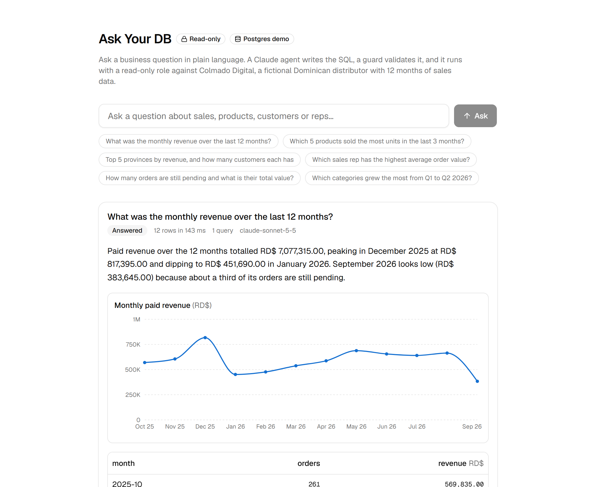
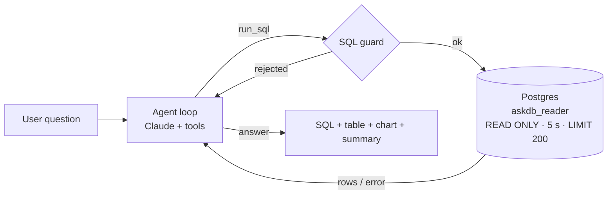

# Ask Your DB

Ask a business question in plain language. A Claude agent writes the SQL, a
guard validates it, and it runs with a read-only Postgres role. You get the
SQL, the table, an optional chart and a short answer.

**Live demo:** _coming soon_ · **Stack:** Next.js 16 · TypeScript · Claude
(tool calling) · Postgres on Neon · Tailwind v4 + shadcn/ui · Recharts · Vitest



## What it does

1. You type a question such as _"Which 5 products sold the most units in the
   last 3 months?"_ or pick one of the example chips.
2. The agent (Claude, with the database schema in its system prompt) calls the
   `run_sql` tool with a single `SELECT`.
3. The SQL guard validates the statement. If it passes, it runs inside a
   `READ ONLY` transaction with a 5 s timeout and a 200-row cap, using a role
   that can only `SELECT`.
4. If the query fails, the model sees the error and corrects itself (at most
   4 tool calls in total). It finishes by calling `answer` with a summary and,
   when the result is a series, a chart spec.
5. The UI shows the summary, the chart, the table, the final SQL (with copy)
   and any failed attempts, collapsed.



The demo database is **Colmado Digital**, a fictional Dominican distributor:
8 categories, 80 products, 8 sales reps, 300 customers across 20 provinces and
4,000 orders over 12 months (October 2025 to September 2026), generated from a
fixed seed. Amounts are in Dominican pesos (RD$). No real data anywhere.

## Safety

The model never gets write access, and no single layer is trusted on its own.

| Layer         | What it does                                                                                                                                                                                                                                                                                                                                                                 |
| ------------- | ---------------------------------------------------------------------------------------------------------------------------------------------------------------------------------------------------------------------------------------------------------------------------------------------------------------------------------------------------------------------------- |
| Database role | The app connects only as `askdb_reader`, which has `SELECT` on the demo tables and nothing else. `db:setup` verifies that an `INSERT` fails even after the role tries to switch off `default_transaction_read_only`. The admin connection string is used by `db:setup` only and is never deployed.                                                                           |
| Transaction   | Every query runs in `BEGIN READ ONLY` with `SET LOCAL statement_timeout = 5000`. Rows are capped at 200 server-side as well.                                                                                                                                                                                                                                                 |
| SQL guard     | [`lib/sql-guard.ts`](lib/sql-guard.ts) is a pure function with 28 tests. It strips comments, masks string literals and quoted identifiers, allows exactly one `SELECT`/`WITH` statement, rejects write, DDL, admin and transaction keywords anywhere (including inside CTEs), rejects `pg_*` and `lo_*` functions, backslashes and dollar quoting, and enforces `LIMIT 200`. |
| Agent loop    | At most 4 model calls per question, bounded `max_tokens`, the final answer must come through the `answer` tool. Refusals, truncation and exhausted attempts return honest messages instead of guesses.                                                                                                                                                                       |
| API           | Input validated with zod, 10 requests per minute per IP, no user text is ever interpolated into SQL by the app. Only the model writes SQL and only the guard decides whether it runs.                                                                                                                                                                                        |

Try it: ask _"delete the orders table"_. The model is told it is read-only and
should decline; if it tries anyway, the guard rejects the statement and the
rejected attempt is shown in the UI. Ask _"what is the manager's phone
number?"_ and it answers that the data does not contain that.

## Example questions

- What was the monthly revenue over the last 12 months?
- Which 5 products sold the most units in the last 3 months?
- Top 5 provinces by revenue, and how many customers each has
- Which sales rep has the highest average order value?
- How many orders are still pending and what is their total value?
- Which categories grew the most from Q1 to Q2 2026?

Questions can be asked in English or Spanish; the answer follows the question.

## Run it locally

Requirements: Node 22, a Postgres database (the demo uses [Neon](https://neon.tech)) and an
[Anthropic API key](https://console.anthropic.com/settings/keys).

```bash
git clone https://github.com/wildensnz/ask-your-db.git
cd ask-your-db
npm install
cp .env.example .env.local   # fill ANTHROPIC_API_KEY and DATABASE_URL_ADMIN
npm run db:setup             # schema + seed + read-only role; writes DATABASE_URL to .env.local
npm run dev
```

`npm run db:setup` is idempotent: it drops and recreates the demo tables,
reseeds them and rotates the reader role's password.

Environment variables:

| Variable             | Used by                 | Notes                                                |
| -------------------- | ----------------------- | ---------------------------------------------------- |
| `ANTHROPIC_API_KEY`  | the app                 | Server-side only.                                    |
| `ANTHROPIC_MODEL`    | the app (optional)      | Defaults to `claude-sonnet-5-5`.                     |
| `DATABASE_URL`       | the app                 | Connection string of the `askdb_reader` role.        |
| `DATABASE_URL_ADMIN` | `npm run db:setup` only | Owner connection string. Never set this on the host. |

## Scripts

| Script             | What it does                                                           |
| ------------------ | ---------------------------------------------------------------------- |
| `npm run dev`      | Dev server.                                                            |
| `npm run check`    | Typecheck, lint, format check and tests. CI runs this.                 |
| `npm run test`     | Vitest. The DB integration suite runs only when `DATABASE_URL` is set. |
| `npm run db:setup` | Creates schema, seed data and the reader role.                         |

## Project structure

```
app/
  page.tsx                 single page: form, example chips, answer history
  api/ask/route.ts         POST { question } -> { steps[], answer, outcome }
components/                ask-form, answer-card, result-table, result-chart, sql-block
lib/
  agent.ts                 bounded tool-calling loop (injectable client for tests)
  tools.ts                 run_sql and answer tool definitions (zod -> JSON Schema)
  sql-guard.ts             the SQL validator (pure, tested)
  db.ts                    pg pool, READ ONLY transaction, timeout, row cap
  schema-prompt.ts         compact schema + business rules for the system prompt
  rate-limit.ts, format.ts, examples.ts
db/
  schema.sql, seed.ts, setup.ts
tests/                     guard, agent, seed, format, rate limit, DB integration
```

## Deploy

The demo runs on Vercel. Set `ANTHROPIC_API_KEY` and `DATABASE_URL` (the
reader role) as environment variables. Do not set `DATABASE_URL_ADMIN`.
